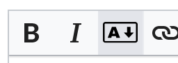

# Argdown

This extension allows contributors to [MediaWiki](https://www.mediawiki.org/wiki/MediaWiki) wikis to write arguments in [Argdown](https://argdown.org/), an easy-to-write, machine-parsable format which allows for the automatic generation of argument maps (not yet supported by this plugin). Arguments will be formatted using [Argdown's official engine for Node.js](https://github.com/christianvoigt/argdown).

## Setup

1. Install [Node.js](https://nodejs.org), version 13 or higher. As of this writing, `apt` doesn't have that version yet; I recommend following options 2 or 3 from [this guide](https://www.digitalocean.com/community/tutorials/how-to-install-node-js-on-ubuntu-20-04#option-2-%E2%80%94-installing-nodejs-with-apt-using-a-nodesource-ppa).
2. [Download the extension](https://github.com/DawnPaladin/Argdown/releases/latest) and unzip it into the folder `mediawiki/extensions/Argdown`
3. `cd` to the `mediawiki/extensions/Argdown` folder and run `npm install` to install the Argdown engine
4. Run `which node` and put the result in `mediawiki/extensions/Argdown/extension.json`, under `config/NodeJsPath/value`. (The extension needs to know the path to your Node.js executable and may not be able to get it from your $PATH.)
5. In `mediawiki/LocalSettings.php`, add this line: `wfLoadExtension( 'Argdown' );`
6. If you'd like a toolbar button for Argdown, add this line too: `wfLoadExtension( 'WikiEditor' );`
7. Navigate to Special:Version on your wiki to verify that the extension is installed.
8. Try it out! Put something like this on one of your pages: `<argdown>[statement]: I am a statement.</argdown>` Save the page. If "[statement]" appears in blue, the extension is working!

If no text appears when you test the extension, most likely the extension needs more memory. By default, PHP allocates 30 MiB of memory to shell commands, which isn't enough to run Node.js. 

To check whether this is the problem, try putting this line in `mediawiki/LocalSettings.php`: `$wgMaxShellMemory = 0;` This will disable the memory limitation. You probably don't want to do that long-term, so if setting `$wgMaxShellMemory` to 0 allows Argdown to appear, try setting it to 20000000 and increase it from there until it works.

If `$wgMaxShellMemory = 0;` doesn't work, please [open a GitHub issue](https://github.com/DawnPaladin/Argdown/issues) and perhaps I can help you find a solution.

## Usage

When editing any wiki page, wrap your argument in `<argdown>` `</argdown>` tags and they'll be formatted in Argdown. 

If you're using [WikiEditor](https://www.mediawiki.org/wiki/Extension:WikiEditor), click this button in the toolbar to insert the Argdown tags:



For more information on composing arguments in Argdown, please see [the official guide](https://argdown.org/guide/creating-argument-maps.html) and [syntax reference](https://argdown.org/syntax/).

## Debugging

This plugin is still under development. If something goes wrong, enabling logging may help to figure out what's going wrong.

To set up the log file, add this to your `LocalSettings.php`:

```php
$wgDebugLogGroups = array(
	'argdown' => 'extensions/Argdown/argdown.log'
);
```

This will create an `argdown.log` file in the extension folder.

## Roadmap

- [x] Argdown to HTML rendering
- [x] Add Argdown button to editing toolbar
- [ ] Display argument maps

## Feedback

If you'd like to report a bug or provide other feedback, please [open a GitHub issue](https://github.com/DawnPaladin/Argdown/issues).

Last tested with MediaWiki 1.35.1 and Argdown 1.5. 
